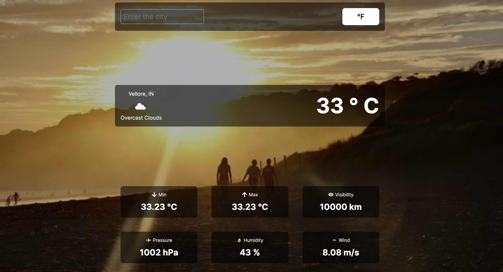

# Weather App With ReactJS

This is a react.js weather app, where you can search for the weather of a place which includes temperature, visibility, pressure, humidity etc. 

Check Here - https://64b7bfd26d09da785269ae37--friendly-medovik-75ade9.netlify.app/

## Steps to use the website

You can follow the below given steps for using this website.

### Clone the repo by using the command
``` git clone https://github.com/devikavarshney/Trademarkia-Weather-App-Task ```

### Open command prompt and direct to the repository's folder (wherever you have cloned it) and run the following command to open code in vscode
``` code . ```

### You can now go through the code and run the web application by typing following command in the prompt
``` npm start ```

### The website will look something like this


